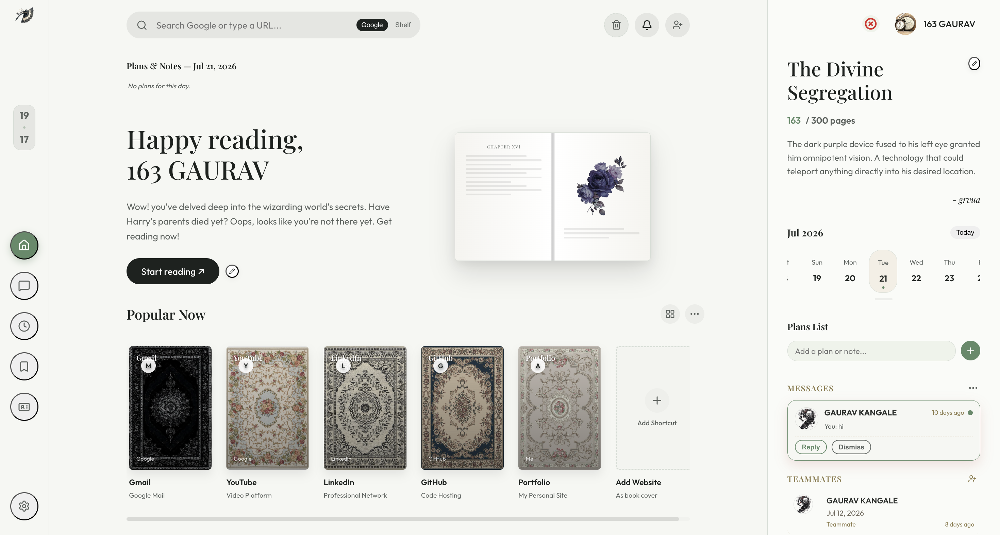

<div align="center">


<br /><br />

<h1 style="color: #3E4E39; font-family: 'Playfair Display', Georgia, serif; font-weight: 700; font-size: 56px; letter-spacing: 3px; margin-bottom: 0; text-transform: uppercase;">Shelf</h1>
<p style="color: #A98F5C; font-family: 'Playfair Display', Georgia, serif; font-weight: 500; font-size: 13px; letter-spacing: 8px; text-transform: uppercase; margin-top: 6px;">Your Personal Reading Dashboard</p>

<br />




<br /><br />

[](https://react.dev)
[](https://vite.dev)
[](https://firebase.google.com)
[](https://nodejs.org)
[](LICENSE)

<h3 style="color: #5C6E52; font-family: 'Playfair Display', Georgia, serif; font-weight: 400; font-style: italic; font-size: 24px; line-height: 1.5; max-width: 640px; margin: 28px auto 0;">A beautifully crafted personal homepage that doubles as your reading life command center.</h3>
<p style="color: #8B9483; font-family: Georgia, serif; font-size: 13px; letter-spacing: 2px; margin-top: 14px;">TRACK BOOKS &nbsp;·&nbsp; TAKE NOTES &nbsp;·&nbsp; MANAGE BOOKMARKS &nbsp;·&nbsp; CONNECT WITH READERS &nbsp;·&nbsp; STAY FOCUSED</p>

<br />

[Visit](https://shelf-books.web.app/#home) &nbsp;·&nbsp; [Features](#features) &nbsp;·&nbsp; [Getting Started](#getting-started) &nbsp;·&nbsp; [Architecture](#architecture) &nbsp;·&nbsp; [Theming](#theming)

</div>

---

<h2 id="features" style="color: #3E4E39; font-family: 'Playfair Display', Georgia, serif; font-size: 30px; letter-spacing: 1px; border-bottom: 1px solid #D8D2BF; padding-bottom: 10px; margin-top: 48px;"> Features</h2>


<h3 style="color: #5C6E52; font-family: 'Playfair Display', Georgia, serif; font-size: 20px; letter-spacing: 0.5px; margin-bottom: 4px;"> BookShelf</h3>
Your personal library at a glance. Drag-and-drop reorder, custom cover images, A-Z sorting, and expandable grid view for all your bookmarked reads.

<h3 style="color: #5C6E52; font-family: 'Playfair Display', Georgia, serif; font-size: 18px; letter-spacing: 0.5px;"> Bookmarks</h3>
Lightning-fast access to your favourite websites presented as beautiful book-cover cards. Drag to the trash bin to delete. Cloud-synced across sessions when logged in.

<h3 style="color: #5C6E52; font-family: 'Playfair Display', Georgia, serif; font-size: 18px; letter-spacing: 0.5px;"> Reading Timer</h3>
A Pomodoro-style timer with live weather, crypto ticker, and news widgets alongside your sessions. Upload a custom dashboard background image to make it truly yours.

<h3 style="color: #5C6E52; font-family: 'Playfair Display', Georgia, serif; font-size: 18px; letter-spacing: 0.5px;"> Daily Notes & Plans</h3>
Date-aware sticky notes pinned to your calendar. Drag a note to the header trash to delete it. Persistent per-user, per-day storage.

<h3 style="color: #5C6E52; font-family: 'Playfair Display', Georgia, serif; font-size: 18px; letter-spacing: 0.5px;"> Notebook Scratchpad</h3>
A full-featured rich-text editor built right into the dashboard. Supports:

- Bold · Italic · Underline · Strikethrough · Headings
- Ordered & unordered lists · Blockquotes · Code blocks · Tables
- Link & image embedding
- Multi-page notebooks with shareable URLs (base64 encoded)
- Export and import notebooks as files

<h3 style="color: #5C6E52; font-family: 'Playfair Display', Georgia, serif; font-size: 18px; letter-spacing: 0.5px;"> Friends & Social</h3>
Find friends by username, send and accept follow requests, browse their public shelves, and chat in real-time with image sharing support.

<h3 style="color: #5C6E52; font-family: 'Playfair Display', Georgia, serif; font-size: 18px; letter-spacing: 0.5px;"> Theming & Appearance</h3>
Multiple hand-crafted theme presets (light & dark), custom color overrides with a live color picker, and adjustable text tones — all persisted to localStorage and synced to the cloud.

<h3 style="color: #5C6E52; font-family: 'Playfair Display', Georgia, serif; font-size: 18px; letter-spacing: 0.5px;"> Authentication</h3>
JWT-based login/signup with full profile management, multiple account switching, and avatar uploads.

---

<h2 id="architecture" style="color: #3E4E39; font-family: 'Playfair Display', Georgia, serif; font-size: 28px; letter-spacing: 1px; border-bottom: 1px solid #D8D2BF; padding-bottom: 10px; margin-top: 48px;"> Architecture</h2>


```
shelf/
├── public/
├── server/
│   ├── index.js
│   └── schema.sql
├── src/
│   ├── components/
│   │   ├── Homepage.jsx
│   │   ├── BookShelf.jsx
│   │   ├── BookmarksSection.jsx
│   │   ├── ReadingTimer.jsx
│   │   ├── NotebookScratchpad.jsx
│   │   ├── NotesSection.jsx
│   │   ├── FriendsSection.jsx
│   │   ├── SettingsPage.jsx
│   │   ├── Header.jsx
│   │   └── ...
│   ├── context/
│   ├── hooks/
│   ├── utils/
│   │   ├── themePresets.js
│   │   ├── apiCache.js
│   │   ├── userKey.js
│   │   └── scratchpadStore.js
│   ├── App.jsx
│   └── index.css
└── vite.config.js
```

---

<h2 id="getting-started" style="color: #3E4E39; font-family: 'Playfair Display', Georgia, serif; font-size: 28px; letter-spacing: 1px; border-bottom: 1px solid #D8D2BF; padding-bottom: 10px; margin-top: 48px;"> Getting Started</h2>

<h3 style="color: #5C6E52; font-family: 'Playfair Display', Georgia, serif; font-size: 18px; letter-spacing: 0.5px;">Prerequisites</h3>

- Node.js >= 18
- npm >= 9

<h3 style="color: #5C6E52; font-family: 'Playfair Display', Georgia, serif; font-size: 18px; letter-spacing: 0.5px;">1. Clone and Install</h3>

```bash
git clone https://github.com/your-username/shelf.git
cd shelf
npm install
cd server
npm install
cd ..
```

<h3 style="color: #5C6E52; font-family: 'Playfair Display', Georgia, serif; font-size: 18px; letter-spacing: 0.5px;">2. Configure Environment</h3>

Create a `.env` file in the project root:

```env
VITE_API_BASE_URL=http://localhost:3001
```

Configure the server's `.env` inside `server/`:

```env
PORT=3001
JWT_SECRET=your_super_secret_key
```

<h3 style="color: #5C6E52; font-family: 'Playfair Display', Georgia, serif; font-size: 18px; letter-spacing: 0.5px;">3. Run in Development</h3>

```bash
npm run dev
```

<h3 style="color: #5C6E52; font-family: 'Playfair Display', Georgia, serif; font-size: 18px; letter-spacing: 0.5px;">4. Available Scripts</h3>

| Script | Description |
|---|---|
| `npm run dev` | Frontend and backend concurrently |
| `npm run dev:frontend` | Vite dev server only (port 5173) |
| `npm run dev:server` | Node server with watch auto-reload |
| `npm run build` | Production bundle to dist/ |
| `npm run preview` | Preview production build locally |
| `npm run lint` | Run ESLint across the codebase |

<h3 style="color: #5C6E52; font-family: 'Playfair Display', Georgia, serif; font-size: 18px; letter-spacing: 0.5px;">5. Deploy to Firebase</h3>

```bash
npm run build
firebase deploy
```

---

<h2 id="theming" style="color: #3E4E39; font-family: 'Playfair Display', Georgia, serif; font-size: 28px; letter-spacing: 1px; border-bottom: 1px solid #D8D2BF; padding-bottom: 10px; margin-top: 48px;"> Theming</h2>

Shelf ships with a rich CSS variable-based theme engine. Every color, font, and surface is controlled through design tokens.

```css
--bg-color:       #f5f4ee;
--accent-color:   #e85d56;
--text-primary:   #1e2022;
--border-color:   #e4e3da;
--card-bg:        #ffffff;
```

Switch between light/dark modes and multiple curated palettes from the Settings page. The `applyTheme()` utility handles real-time CSS variable injection.

---

<h2 id="api" style="color: #3E4E39; font-family: 'Playfair Display', Georgia, serif; font-size: 28px; letter-spacing: 1px; border-bottom: 1px solid #D8D2BF; padding-bottom: 10px; margin-top: 48px;"> API Overview</h2>

The Express backend exposes a REST API for all cloud-synced features:

| Method | Endpoint | Description |
|--------|----------|-------------|
| `POST` | `/api/auth/register` | Create a new account |
| `POST` | `/api/auth/login` | JWT login |
| `GET`  | `/api/shortcuts` | Fetch bookmarks |
| `POST` | `/api/shortcuts` | Save bookmarks |
| `GET`  | `/api/preferences` | Fetch user preferences |
| `POST` | `/api/preferences` | Save preferences & theme |
| `GET`  | `/api/friends` | List friends |
| `POST` | `/api/friends/request` | Send a friend request |
| `GET`  | `/api/messages/:friendId` | Fetch chat history |
| `POST` | `/api/messages` | Send a message |

---

<h2 id="tech-stack" style="color: #3E4E39; font-family: 'Playfair Display', Georgia, serif; font-size: 28px; letter-spacing: 1px; border-bottom: 1px solid #D8D2BF; padding-bottom: 10px; margin-top: 48px;"> Tech Stack</h2>

| Layer | Technology |
|-------|-----------|
| **Frontend Framework** | [React 19](https://react.dev) |
| **Build Tool** | [Vite 8](https://vite.dev) |
| **Icons** | [Lucide React](https://lucide.dev) |
| **Styling** | Vanilla CSS + CSS Custom Properties |
| **Backend** | Node.js, Express |
| **Database** | SQLite via better-sqlite3 |
| **Authentication** | JSON Web Tokens |
| **Hosting** | Firebase Hosting |

---

<h2 id="key-files" style="color: #3E4E39; font-family: 'Playfair Display', Georgia, serif; font-size: 28px; letter-spacing: 1px; border-bottom: 1px solid #D8D2BF; padding-bottom: 10px; margin-top: 48px;"> Key Files</h2>

| File | Purpose |
|------|---------|
| [`src/App.jsx`](src/App.jsx) | Root component, routing, profile management |
| [`src/index.css`](src/index.css) | Global design system |
| [`src/components/NotebookScratchpad.jsx`](src/components/NotebookScratchpad.jsx) | Full rich text editor engine |
| [`src/components/FriendsSection.jsx`](src/components/FriendsSection.jsx) | Real-time messaging & social graph |
| [`src/utils/themePresets.js`](src/utils/themePresets.js) | Theme presets & CSS variable injection |
| [`server/index.js`](server/index.js) | Full Express REST API |
| [`server/schema.sql`](server/schema.sql) | SQLite database schema |

---

<h2 id="contributing" style="color: #3E4E39; font-family: 'Playfair Display', Georgia, serif; font-size: 28px; letter-spacing: 1px; border-bottom: 1px solid #D8D2BF; padding-bottom: 10px; margin-top: 48px;"> Contributing</h2>

Pull requests are welcome! For major changes, please open an issue first to discuss what you would like to change.

```bash
git checkout -b feat/amazing-feature
git commit -m 'feat: add amazing feature'
git push origin feat/amazing-feature
```


<div align="center">


<p style="color: #8B9483; font-family: 'Playfair Display', Georgia, serif; font-style: italic; font-size: 15px; margin-top: 14px;">Made with passion and a lot of coffee &nbsp;·&nbsp; Built by <a href="https://github.com/gauravkangale" style="color: #3E4E39;">Gaurav Kangale</a></p>

<br />

<p style="color: #3E4E39; font-family: 'Playfair Display', Georgia, serif; font-size: 13px; letter-spacing: 2px; text-transform: uppercase;"> Star this repo if Shelf made your reading life better</p>

</div>